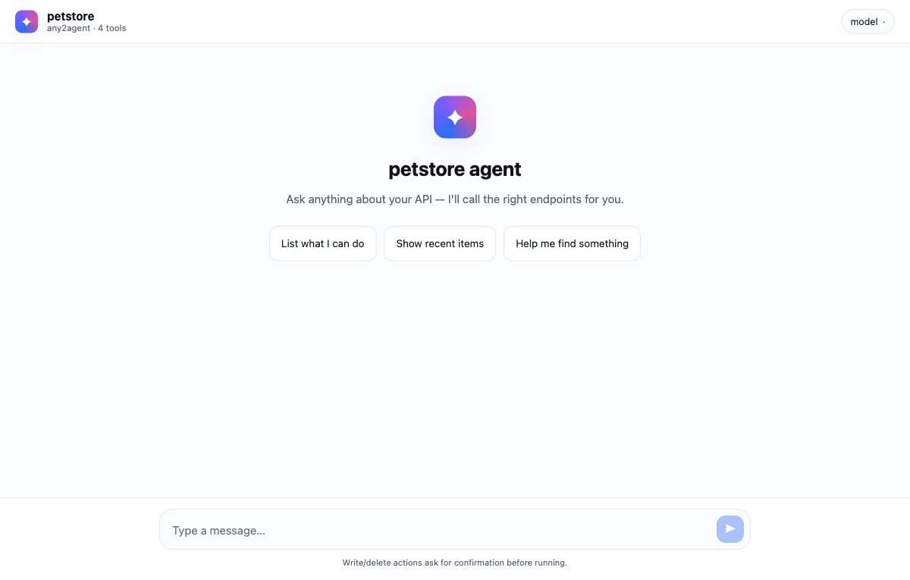
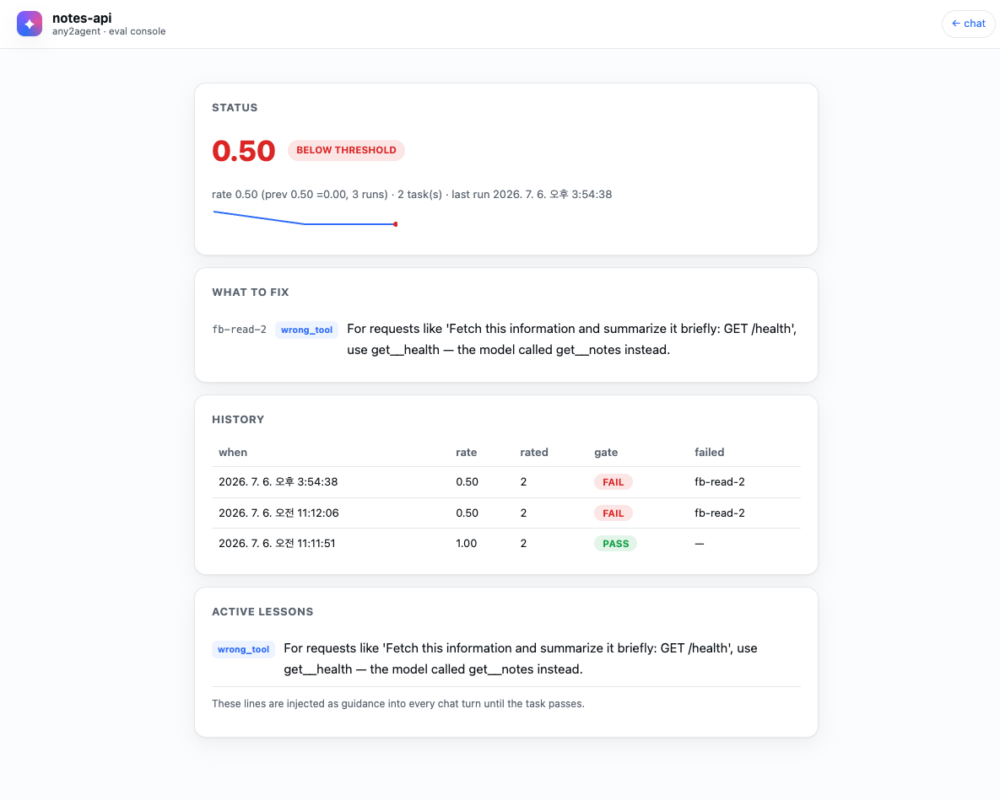

# any2agent

**Point it at your project. Get a working AI agent.**

[](LICENSE)
[](https://www.python.org/)
[](CONTRIBUTING.md)

any2agent turns an existing API-backed project into a chat agent — **without you
writing any glue code**. It reads your API (from an OpenAPI file *or your source
code*), works out the routes **and how you authenticate users**, builds a tool
set, **checks it against your live API**, and serves a chat UI. Then it goes one
step further: it **proves the agent can complete real tasks** (`eval`) and
**learns from every failure**.

```
your project ──▶  any2agent connect  ──▶  a chat agent that calls your API
                  scan → verify → repair (loops until it actually works)
                       └─▶ eval: real tasks through the real agent → completion rate
                           failures become lessons the agent won't repeat
```


### The agent it serves



A clean, multi-model chat over **your** API — read tools run instantly, write/delete
actions pause for confirmation, and every call carries the logged-in user's session.

> 🎥 The clip above is a real `connect` run on the included
> [`examples/notes-api`](examples/notes-api) — re-render it any time with `vhs demo.tape`.

---

## Why it's different

Most "OpenAPI → tools" projects need you to **already have a spec** and stop
there. any2agent goes further:

| | Others | **any2agent** |
|---|:---:|:---:|
| Input | OpenAPI spec only | **Spec OR your source tree** |
| Auth / permissions | you wire it | **detected from your code, user session passed through (RBAC kept)** |
| Correctness | trust the output | **verify → repair loop with an honest report** |
| Does it actually work? | you find out in prod | **`eval`: realistic multi-step tasks through the real agent, graded against your live API** |
| When it fails | you debug | **failures become one-line fixes + lessons the agent applies in every chat turn** |
| Visibility | logs, maybe | **trust badge + `/evals/ui` console (rate trend, history, what-to-fix)** |
| Onboarding | manual | **one `connect` command** |

---

## Install

```bash
pip install git+https://github.com/vibeuniv/any2agent
```

---

## Quickstart (2 steps)

> Full step-by-step guide (connect → eval → serve → console, CI usage,
> troubleshooting): **[docs/USAGE.md](docs/USAGE.md)**

```bash
# 1) one model key — any one of these
export OPENAI_API_KEY=...     # or ANTHROPIC_API_KEY / GEMINI_API_KEY / MOONSHOT_API_KEY

# 2) connect — the wizard asks a few questions and does the rest
cd /path/to/your-project
any2agent connect
```

What you'll see (real output):

```text
[connect] guessed base URL (from source): http://localhost:3000
[connect] auth analysis: scheme=supabase-ssr carrier=cookie confidence=high
  -> passthrough the user's session cookie(s): ['sb-']
[connect] scanning: /path/to/your-project
  framework=nextjs  routes=45
[connect] verify round 1/4  (live=False)
  [PASS] coverage  45/45 (100%)  missing=0
  [PASS] accuracy  checked=45 bad=0
[connect] ✅ all checks passed
[connect] wrote: yourapp.toolspec.json (tools=45 write=21 danger=2), yourapp.any2agent.toml
```

Then start the chat:

```bash
any2agent serve --project yourapp     # → http://127.0.0.1:8800
```

Open the URL and talk to your API. **That's it.**

---

## Three ways to connect

| You have… | Use | Command |
|---|---|---|
| Just the source code | **`connect`** (scans code) | `any2agent connect --path ./app --base-url http://localhost:3000` |
| An OpenAPI / Swagger spec | **`init`** (fast path) | `any2agent init --openapi ./openapi.json --project app --base-url https://api.app.com` |
| A spec, tools only (no run) | **`scan`** | `any2agent scan --openapi ./openapi.json --project app` |

Runnable example: [`examples/petstore`](examples/petstore).

---

## What it generates (named after your project)

| File | Purpose |
|---|---|
| `yourapp.toolspec.json` | the tools — one per API operation. Editable, re-runnable. |
| `yourapp.any2agent.toml` | config: base URL, auth method, default model. |
| `yourapp.evals.json` | eval tasks for `any2agent eval` — auto-generated, then yours to curate. |
| `yourapp.eval-lessons.json` | guidance learned from eval failures — auto-managed, injected at serve time. |

Re-run `connect`/`init` whenever your API changes.

---

## Self-verification — `any2agent eval`

The connect loop proves your tools *exist, are well-formed, respond, and get
selected*. `eval` proves the thing that actually matters: **the agent completes
realistic multi-step tasks** against your live API.

```bash
any2agent eval --project yourapp            # read-only tasks (safe default)
any2agent eval --project yourapp --live-write   # allow write tasks (never on production)
```

- Tasks are generated from your toolspec (multi-step by design), saved to
  `yourapp.evals.json`, and validated — curate them into a regression suite.
- Each task runs through the **real** agent loop; grading prefers deterministic
  checks (which tools ran, re-reading state, answer content) over an LLM judge.
- Gate: completion rate ≥ 0.8 → exit 0; below → exit 1 with per-task reasons.
  CI-friendly (`--json report.json`).
- `connect --eval` runs it as a final gate and feeds failures back into repair
  (description rewrites with the failure as context, param synthesis from 4xx
  calls).
- Write tasks are opt-in, tag their payloads with `[a2a-eval]`, clean up after
  themselves, and report any residue honestly.
- **It learns from failures.** Each run is recorded (`eval --history` shows the
  trend), every failure becomes one actionable "what to fix" line, and lessons
  persist to `yourapp.eval-lessons.json` — `serve` injects them as guidance so
  the agent doesn't repeat the same mistake. `eval --fix` applies automatic
  repairs on the spot.
- **See it in the browser.** The chat header shows a trust badge
  (`✅ 0.88 · 3 runs`) that links to `/evals/ui` — a read-only console with the
  rate trend, run history, what-to-fix lines, and active lessons.



> Real console after three eval runs on `examples/notes-api`: the rate dropped
> to 0.50, the failure was classified `wrong_tool` with a one-line fix, and the
> lesson at the bottom is now injected into every chat turn.

---

## Models — every major LLM platform (via LiteLLM)

A model appears in the chat picker **only when its key is set** — set one or many.

| Provider | Env var | Model override |
|---|---|---|
| OpenAI | `OPENAI_API_KEY` | `OPENAI_MODEL` |
| Anthropic (Claude) | `ANTHROPIC_API_KEY` | `CLAUDE_MODEL` |
| Google (Gemini) | `GEMINI_API_KEY` | `GEMINI_MODEL` |
| Mistral | `MISTRAL_API_KEY` | `MISTRAL_MODEL` |
| Groq | `GROQ_API_KEY` | `GROQ_MODEL` |
| DeepSeek | `DEEPSEEK_API_KEY` | `DEEPSEEK_MODEL` |
| xAI (Grok) | `XAI_API_KEY` | `XAI_MODEL` |
| Moonshot (Kimi) | `MOONSHOT_API_KEY` | `KIMI_MODEL` |
| Cohere | `COHERE_API_KEY` | `COHERE_MODEL` |
| Perplexity | `PERPLEXITYAI_API_KEY` | `PERPLEXITY_MODEL` |
| Together AI | `TOGETHERAI_API_KEY` | `TOGETHER_MODEL` |
| OpenRouter (200+ models) | `OPENROUTER_API_KEY` | `OPENROUTER_MODEL` |
| Ollama (local) | `OLLAMA_HOST` | `OLLAMA_MODEL` |

**Anything else** (Azure OpenAI, AWS Bedrock, Vertex AI, or any other
[LiteLLM-supported](https://docs.litellm.ai/docs/providers) model) — no code change:

```bash
export ANY2AGENT_MODELS="azure/my-deploy, bedrock/anthropic.claude-3-5-sonnet-20241022-v2:0"
```
(LiteLLM reads each provider's own credentials from the environment.)

Tip: `cp .env.example .env` and fill in what you have. No key at all? Scanning
and verifying still work — only the chat needs a model.

---

## Authentication & permissions

any2agent **never invents access.** It forwards the **logged-in user's own
session/token** to every API call (*passthrough*), so your backend enforces roles
exactly as it already does — the agent has no extra privileges.

- `connect` reads your code and picks the mode automatically: a cookie
  (`sb-*`, `JSESSIONID`, …), `Authorization: Bearer`, or a custom header.
- A `401`/`403` from your API means *"not allowed for this user"* — treated as
  correct, not an error.
- Write/delete tools **pause for one-click confirmation** in the chat.

Credentials live in environment variables (named in `yourapp.any2agent.toml`).
**Secrets never go in the repo.**

---

## Memory (remembers facts across sessions)

The agent can save small, durable facts a user tells it ("default to short
answers", "my team is payments") and recall them in later turns **and future
sessions**. Relevant notes are surfaced to the model automatically each turn; it
can also `remember`/`forget` on its own.

**Learns from feedback.** Every answer has a 👍 / 👎. A 👎 lets the user say what
they actually wanted — that correction is remembered and applied next time. (This
is the only "self-learning" that's safe by design: see the invariant below.)

- **Per-user isolation.** Each user's notes live in their own file — there is no
  cross-user read path, so memory can never leak between users.
- **No extra key.** Recall is keyword-based (no embeddings), so memory works with
  any provider — or none.
- **Secrets are refused** on write (passwords/tokens/keys are never stored).
- **Data, never policy.** Memory only ever flows to the model as informational
  context — nothing in the confirm/auth path reads it, so a note can't loosen the
  write-confirm gate or RBAC. Text that reads like a permission change is refused.

Scope it per user by pointing `memory_owner_header` in `yourapp.any2agent.toml`
at a header your app sets to a stable user id (e.g. `X-User-Id`); the embedding
app forwards it like the session. Without it, notes share one local bucket — fine
for single-user/local. Set `memory_enabled = false` to turn it off.

---

## How it works

```
1. scan      OpenAPI spec OR source tree   → tools + the true route list
2. auth      detect the login/session scheme → passthrough plan
3. verify    coverage · correctness · live calls · agent tool-selection
4. repair    fill gaps (params, descriptions, missing routes) → re-verify
5. eval      (opt-in) realistic tasks through the real agent loop → completion gate
6. serve     chat UI + /chat API  (multi-model, write/danger confirm gate)
```

The loop stops when **all checks pass**, or at a budget/no-progress limit — and
then prints exactly what's still unverified (it never silently claims success).

---

## FAQ / Troubleshooting

**No model shows up in the picker.** No provider key is set — `export OPENAI_API_KEY=...`
(or another) and refresh.

**`connect` says base_url is empty / can't reach the API.** Edit `base_url` in
`yourapp.any2agent.toml` to where your API actually runs, then `any2agent serve`.

**Everything returns 401/403 during verify.** Your API requires a login — that's
expected. Pass a logged-in user's session for verification:
`any2agent connect --live --session-cookie "sb-...=..."` (or `--session-bearer`).
In production the embedding app forwards the end-user's session automatically.

**My framework isn't detected.** `connect` supports FastAPI, Flask, Express,
NestJS, Spring, and Next.js today. If yours is missing, generate an OpenAPI spec
and use `init`, or open an issue — new scanners are easy to add (see
[CONTRIBUTING](CONTRIBUTING.md)).

**Signed requests (HMAC/SigV4) or mTLS.** Can't be done by token passthrough;
`connect` warns and you'll need a custom adapter.

---

## Requirements

- Python 3.9+
- One LLM provider key (for the chat and optional smart repair)
- Your target API reachable at a base URL (for live verification & runtime)

## Contributing

New framework scanners, auth detectors, and transport adapters are the most
valuable contributions — see [CONTRIBUTING.md](CONTRIBUTING.md).

## License

[Apache-2.0](LICENSE). Ships with **no** vendor data or proprietary tool
catalogs — bring your own API.

The **code** is Apache-2.0 — use it, fork it, build on it freely. The **name and
logo** "any2agent" are the project's marks: please don't use them to brand a
fork or a hosted service in a way that implies it's official or endorsed.
